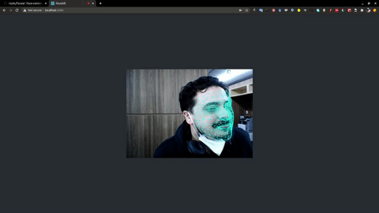

# Face-centered Augmented Reality for the browser

  

  This is a sample project using [Google's Facemesh](https://github.com/tensorflow/tfjs-models/tree/master/facemesh) and [react-three-fiber](https://github.com/react-spring/react-three-fiber) to show how to use such technologies to construct a face-centered AR solution that runs in the browser (i.e all inference and redereing occurs in the browser).


## How to run


``` export HTTPS=true && yarn start ```
